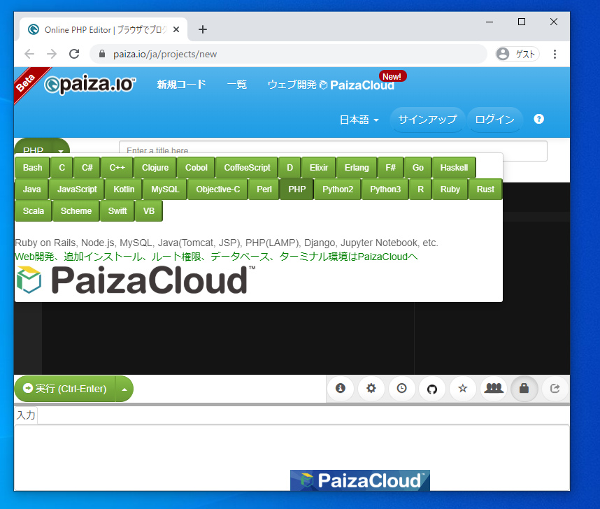
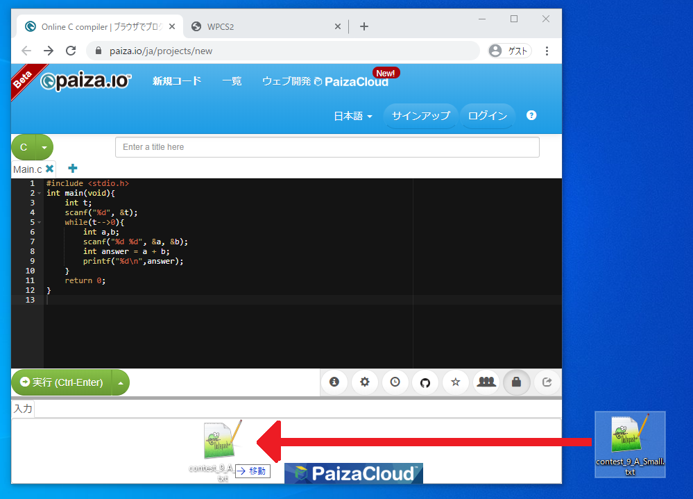
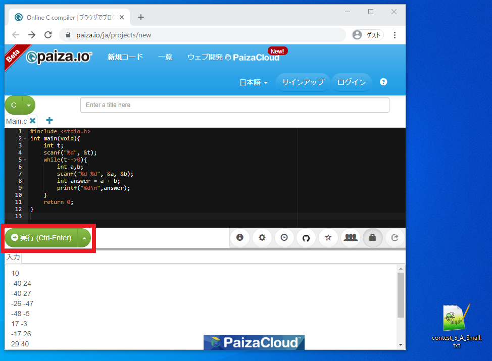
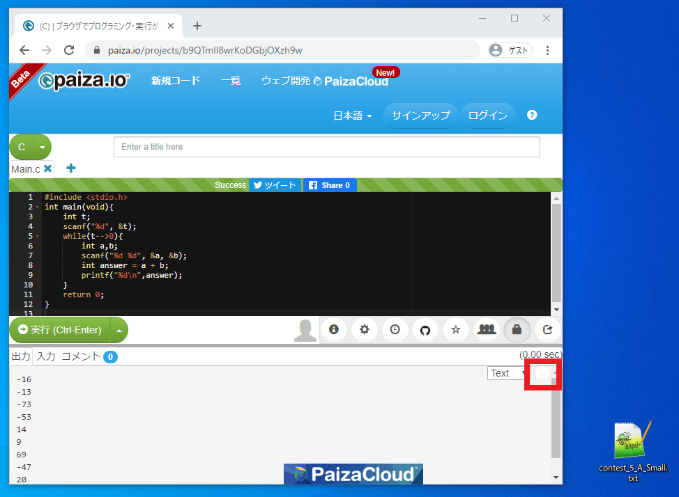

# Description

2つの整数 $A, B$ の和を求めよ。

なお、この問題は入出力の練習のために用意されている。
問題の末尾にサンプルプログラムなどが示されているので、参考にせよ。

# Constraints

* $A, B$ は整数
* $-5000 \leq A, B \leq 5000$

# Input
1つの入力ファイルは複数のテストケースからなる。

入力ファイルの最初の1行目にはテストケースの個数 $T$ が記される $(1 \leq T \leq 50)$ 。

2行目以降には、$T$ 個のテストケースが記述されており、各テストケースは次の形式で表される。

```
$A$ $B$
```

# Output
各テストケースに対して、$A+B$ を1行ずつ出力せよ。

# Sample Input
```
3
1 2
-4 2
-100 100
```

# Sample Output
```
3
-2
0
```

# Sample Programs

## C

```
#include &lt;stdio.h&gt;

int main() {
    int t;
    scanf("%d", &t);
    while (t-- > 0){
        int a, b;
        scanf("%d %d", &a, &b);
        int answer = 0; // EDIT HERE
        printf("%d\n", answer);
    }
    return 0;
}
```

## Java

```
import java.util.Scanner;

public class Main {
    public static void main(String[] args) {
        Scanner sc = new Scanner(System.in);
        int n = sc.nextInt();
        for(int i=0; i < n; i++){
            int a = sc.nextInt();
            int b = sc.nextInt();
            System.out.println(0); // EDIT HERE
        }
        sc.close();
    }
}
```

# Answer Book[自分の開発環境を使用する場合の例]

## 言語に依らない共通作業

1. 本画面の最下部にある提出フォームにおいて、フォーム左上で適切なデータセット(`Small` or `Large`)を選択して、
フォーム右上で`Smallのダウンロード`もしくは`Largeのダウンロード`を押す。

1. ダウンロードしたファイルをソースコードと同じディレクトリに移動して、`in.txt`にリネームする。

## C言語

1. ソースコードをコンパイルする
    
    ```
    gcc main.c
    ```

    コンパイルでは必要に応じて、``-O2``や``-Wall``などのコンパイルオプションを使用するとよいかもしれない。

1. キーボード入力の代わりに`in.txt`を読み込んで、実行結果を`out.txt`に出力するように、プログラムを実行する

    ```
    ./a.out < in.txt > out.txt
    ```

## Java

1. ソースコードをコンパイルする

    ```
    javac Main.java
    ```

1. キーボード入力の代わりに`in.txt`を読み込んで、実行結果を`out.txt`に出力するように、プログラムを実行する
    
    ```
    java Main < in.txt > out.txt
    ```

## C++ / Python / Ruby / 他

上記を参考に、自分で調べてください。

## 提出方法についての注意

解答を提出する際は、**上記のAnswer Bookを参考に、`in.txt`を入力して`out.txt`を出力するようにプログラムを実行して、`out.txt`の中身をテキストボックスに貼り付ける** 方法を強く推奨します。

（実行結果を`out.txt`に出力せずに画面に表示してしまうと、表示される内容が多すぎて、画面からコピーすることが難しいためです。）

# Answer Book[ブラウザ上での開発環境を使用する場合の例]
## step1: ページを開く
初めに、　[paiza.io](https://paiza.io/ja/projects/new)　にアクセスします。
そうするとこのような画面が表示されます。
表示されたら、赤枠の中の緑色の部分にカーソルを合わせるかクリックをしましょう。


## step2: 使用言語を選択する
すると様々なプログラミング言語が表示されます。
使用したい言語をクリックしましょう。



## step3: コードを書く
これにより言語にあわせたファイルが生成されます。
このファイルを書き換えて、問題を解けるコードにしていきましょう。


## step4: 入力ファイルをドラッグ＆ドロップする
コードが完成したら、コンテストサイトからダウンロードしてきたファイルを、入力ボックスの中にドラッグ＆ドロップしましょう。



## step5: コードを実行する
そうすると入力ボックスの中に、先程のファイルの中身が表示されているはずです。
それが確認できたら、実行ボタンを押しましょう。



## step6: 実行結果を確認する
実行が無事に終わった場合は、画面上部にSuccessと表示され、入力ボックスの中身がコードを実行したときの出力に置き換わっているはずです。
この出力が正しいものであると感じたら、コンテストサイトに送信する段階に移ります。

まずは、出力結果が表示されている部分の右側に、薄く矢印が表示されているはずです。
これをクリックしましょう。
（もし表示されていない場合は、出力結果ではなくて入力結果を表示しているかもしれません。再度実行ボタンを押すなどしましょう。）



## step7: コンテストサイトに実行結果を送信する
先程の矢印ボタンを押すと、左のように出力結果のみが表示される画面が表示されます。
これをまず全てコピーして、右のようなコンテストサイトの提出部分にペーストしましょう。
後は提出ボタンをクリックすれば提出完了です。


